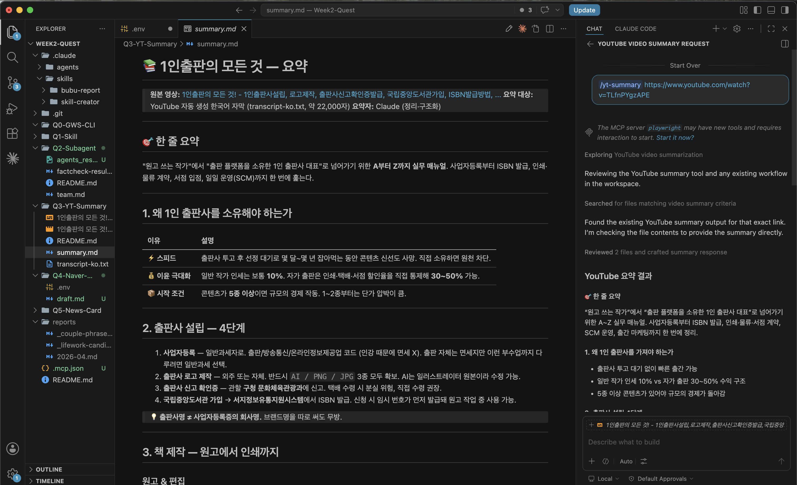

# Q3 — YouTube 자막 다운로드 & 요약

`yt-dlp`로 유튜브 영상의 자막을 받아 → 깨끗한 transcript로 변환 → 구조화된 한글 요약을 만드는 파이프라인.

## 대상 영상
**[1인출판의 모든 것! - 1인출판사설립, 로고제작, 출판사신고확인증발급, 국립중앙도서관가입, ISBN발급방법, 책원고작성, 물류창고계약, 지업사, 인쇄소, 제본소결정, 서점계약, 출간마케팅, 신간등록](https://www.youtube.com/watch?v=TLfnPYgzAPE)**

1인 출판사 설립부터 일일 운영까지를 한 영상에 압축한 두꺼운 실무 가이드.

## 사용 도구

```bash
# 설치
brew install yt-dlp

# 영상 + 자막 다운로드 (720p, 한국어 자막)
yt-dlp \
  --write-auto-subs \
  --sub-langs "ko,en" \
  -f "best[height<=720]/best" \
  -o "%(title)s.%(ext)s" \
  "https://www.youtube.com/watch?v=TLfnPYgzAPE"
```

> ⚠️ 영어 자막은 YouTube 429 (rate limit)로 실패. 한국어가 원어라 요약엔 영향 없음.

## 산출물

| 파일 | 크기 | 설명 | 깃 추적 |
|------|------|------|---------|
| `*.mp4` | 484 MB | 원본 영상 (720p) | ❌ (.gitignore) |
| `*.ko.vtt` | 405 KB | YouTube 자동 생성 자막 (인라인 타이밍 코드 포함) | ❌ (.gitignore) |
| [transcript-ko.txt](transcript-ko.txt) | 54 KB | 타이밍·중복 제거한 깨끗한 텍스트 (1,216줄) | ✅ |
| **[summary.md](summary.md)** | 8.7 KB | **구조화된 한글 요약 (최종 산출물)** | ✅ |

## 처리 파이프라인

```
YouTube URL
   │
   ▼ yt-dlp
*.mp4 (영상) + *.ko.vtt (자막)
   │
   ▼ Python (정규식으로 타이밍 태그 제거 + 중복 행 제거)
transcript-ko.txt
   │
   ▼ Claude (의미 단위 묶기 + 9개 섹션 구조화)
summary.md
```

VTT 정리 스크립트 핵심:

```python
import re, pathlib
text = pathlib.Path('*.ko.vtt').read_text(encoding='utf-8')
lines, prev = [], None
for raw in text.splitlines():
    if raw.startswith(('WEBVTT', 'Kind:', 'Language:')): continue
    if '-->' in raw or not raw.strip(): continue
    clean = re.sub(r'<[^>]+>', '', raw).strip()
    if clean and clean != prev:
        lines.append(clean); prev = clean
```

## 요약 결과 (요점)

- **한 줄로:** "원고 쓰는 작가"에서 "1인 출판사 대표"로 넘어가는 A~Z 매뉴얼
- **핵심 인사이트:** 인세 10% vs 자가 출판 30~50%, 콘텐츠 5종 이상 확보 후 시작, 물류창고는 사실상 종신계약
- 9개 섹션: 진입 이유 → 설립 4단계 → 책 제작 → 외부 파트너 → 입고 → 서점 계약 → 일일 운영 → 마케팅 → Q&A
- 자세한 내용은 [summary.md](summary.md) 참조

## 스크린샷

