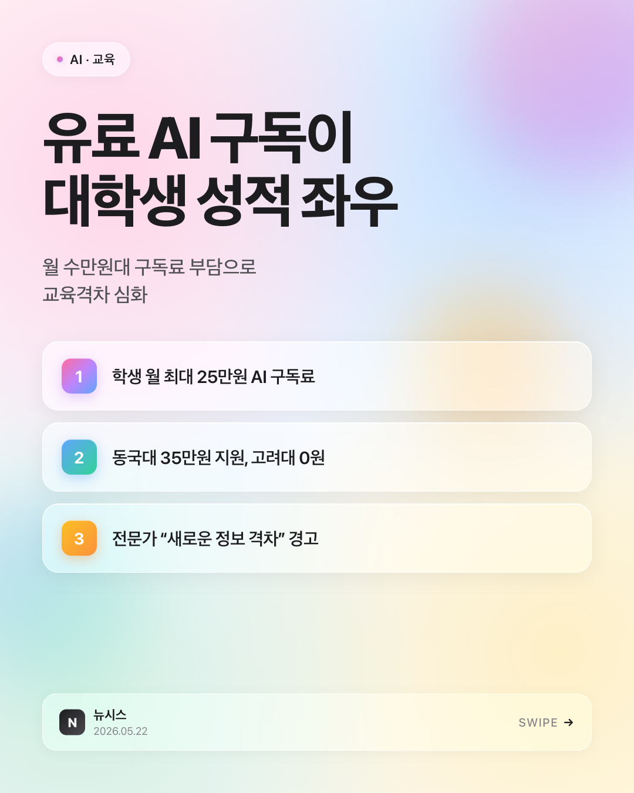

# Q5 — 인스타그램 뉴스 카드 자동화 (`/news-card`)

## 무엇을 했는가

기사·웹페이지 **URL 하나만 주면** 인스타그램용 뉴스 카드(HTML + PNG)를 자동으로 만들어주는 스킬을 제작했습니다.

- 스킬 이름: **`news-card`**
- 스킬 정의: [.claude/skills/news-card/SKILL.md](../.claude/skills/news-card/SKILL.md)
- 디자인 템플릿: [.claude/skills/news-card/templates/glass.html](../.claude/skills/news-card/templates/glass.html)
- 도구 조합: **WebFetch**(기사 본문 추출) + **Write/Edit**(HTML 생성) + **Playwright MCP**(1080×1350 PNG 캡처)

애플 스타일 글래스모피즘 디자인의 **1080×1350 (4:5 인스타 피드)** 카드를 생성하며, 헤드라인 / 서브타이틀 / 핵심 포인트 3가지 / 출처·날짜 구성으로 한 장에 들어갈 정보를 압축합니다.

## 어떻게 실행하는가

### 1. 준비물
- VS Code + Claude Code 확장
- [.mcp.json](../.mcp.json)에 등록된 `@playwright/mcp` (이 저장소에 포함)
- `python3` (PNG 변환 시 로컬 HTTP 서버 우회용)

### 2. 실행 방법
1. VS Code 재시작 또는 `Cmd+Shift+P → Reload Window`로 스킬 레지스트리 새로고침
2. 새 대화에서 다음 중 하나로 트리거:
   - 명시 호출: `/news-card https://example.com/article/123`
   - 자연어: `"이 URL로 인스타 뉴스 카드 만들어줘"`, `"이 기사 카드뉴스로 정리해줘"`
3. AI가 URL 분석 → 핵심 포인트 3개 추출 → **사용자에게 컨펌받기**
4. 글래스모피즘 HTML 생성 → 로컬 HTTP 서버(8765) 띄움 → Playwright로 PNG 캡처
5. 같은 폴더에 `.html` + `.png` 저장 후 사용자에게 보고

### 3. 4단계 워크플로우

```
URL
 │
 ▼ WebFetch
헤드라인·서브타이틀·핵심 포인트 3개·출처·날짜
 │
 ▼ 사용자 컨펌 (포인트가 약하면 옵션 A/B/C 재제안)
확정된 콘텐츠
 │
 ▼ glass.html 템플릿 placeholder 치환
newscard-YYYY-MM-DD.html
 │
 ▼ Python http.server 8765 + Playwright MCP (1080×1350)
newscard-YYYY-MM-DD.png
```

> ⚠️ **`file://` 차단 우회**: Playwright는 `file://` 프로토콜을 차단하므로 Python `http.server`를 8765 포트로 띄워 `http://localhost:8765/...`로 우회합니다. 캡처 후 자동 종료.

## 결과물

| 파일 | 내용 |
|------|------|
| [output/newscard-2026-05-23.html](output/newscard-2026-05-23.html) | 자체 완결형 HTML (외부 의존성 0) |
| [output/newscard-2026-05-23.png](output/newscard-2026-05-23.png) | 1080×1350 PNG (인스타 업로드용) |

### 미리보기



### 원본 기사
[newsis — "유료 구독이 성적 가른다"…대학가 번지는 'AI 디바이드'](https://www.newsis.com/view/NISX20260520_0003637590)

### 추출된 콘텐츠
- **헤드라인**: 유료 AI 구독이 / 대학생 성적 좌우
- **서브타이틀**: 월 수만원대 구독료 부담으로 / 교육격차 심화
- **핵심 포인트 3**:
  1. 학생 월 최대 25만원 AI 구독료
  2. 동국대 35만원 지원, 고려대 0원
  3. 전문가 "새로운 정보 격차" 경고

## 설계 포인트

- **핵심 포인트는 구체적 숫자 > 추상 표현.** "정보 불평등 심화" 같은 두루뭉술 금지, "동국대 35만원 vs 고려대 0원" 같은 직접 비교 우선. SKILL.md에 박제.
- **사용자 컨펌 단계 필수.** 카드는 한 번 만들면 끝이라 포인트가 약하면 다시 작업 = 비용. 추출 직후 사용자에게 보여주고 컨펌받는 단계를 SOP에 명시.
- **자체 완결형 HTML.** 외부 폰트·이미지·CDN 의존 0 — 단일 `.html` 파일을 어디서든 열 수 있고, Playwright 캡처도 안정적.
- **애플 글래스모피즘.** 다크 톤보다 밝은 파스텔 + `backdrop-filter: blur(30px) saturate(180%)` + 컬러 블롭으로 iOS 위젯 톤. 사용자 선호 반영.
- **인스타 발행은 사람 손으로.** 스킬은 PNG 생성까지만. 자동 업로드 없음.

## 스크린샷


